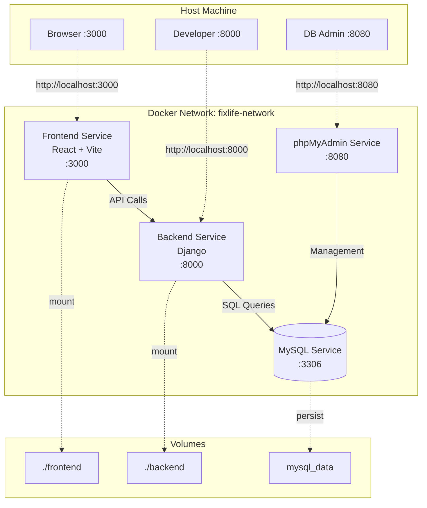

# Design Document: Docker Full Stack Setup

## Overview

Este diseño técnico describe la implementación de un entorno de desarrollo completo dockerizado para el proyecto Fixlife. La solución orquesta 4 servicios mediante Docker Compose: frontend React (existente), backend Django (estructura base), MySQL y phpMyAdmin.

El objetivo principal es proporcionar un entorno de desarrollo que se inicie con un solo comando (`docker-compose up`) y soporte hot reload para desarrollo ágil. El backend Django se entregará como estructura base lista para desarrollo, sin lógica de negocio implementada.

### Objetivos de Diseño

1. **Simplicidad operacional**: Un comando para iniciar todo el stack
2. **Desarrollo ágil**: Hot reload en frontend y backend
3. **Modularidad**: Estructura backend organizada para crecimiento futuro
4. **Persistencia**: Datos de MySQL preservados entre reinicios
5. **Visibilidad**: phpMyAdmin para inspección visual de datos

### Alcance

**Incluido:**
- Configuración Docker Compose multi-servicio
- Dockerfiles optimizados para desarrollo
- Estructura base Django con vistas modulares vacías
- Configuración MySQL con persistencia
- Integración phpMyAdmin
- Configuración CORS para desarrollo local
- Documentación de uso

**No incluido:**
- Lógica de negocio en Django
- Modelos de base de datos
- Implementación de endpoints funcionales
- Configuración de producción
- CI/CD pipelines

## Architecture

### Arquitectura de Servicios

El sistema utiliza una arquitectura de microservicios orquestada por Docker Compose. Los 4 servicios se comunican a través de una red Docker interna, con puertos expuestos selectivamente al host para desarrollo.



### Orden de Inicio

Los servicios deben iniciar en un orden específico para evitar errores de conexión:

1. **MySQL Service**: Inicia primero, healthcheck verifica disponibilidad
2. **Backend Service**: Espera a MySQL healthcheck antes de iniciar
3. **phpMyAdmin Service**: Espera a MySQL healthcheck antes de iniciar
4. **Frontend Service**: Puede iniciar independientemente

### Comunicación entre Servicios

- **Frontend → Backend**: HTTP requests a `http://localhost:8000` desde el navegador
- **Backend → MySQL**: Conexión TCP usando hostname `mysql` (nombre del servicio) en puerto 3306
- **phpMyAdmin → MySQL**: Conexión TCP usando hostname `mysql` en puerto 3306
- **Developer → Servicios**: Acceso directo vía puertos expuestos en localhost

## Components and Interfaces

### 1. Docker Compose Orchestrator

**Responsabilidad**: Orquestar los 4 servicios, gestionar red y volúmenes

**Archivo**: `docker-compose.yml` en raíz del proyecto

**Configuración clave**:
```yaml
version: '3.8'

services:
  frontend:
    # Configuración existente preservada
    
  backend:
    build:
      context: ./backend
      dockerfile: ../docker/Dockerfile.dev
    depends_on:
      mysql:
        condition: service_healthy
    environment:
      - DB_HOST=mysql
      - DB_PORT=3306
      - DB_NAME=${MYSQL_DATABASE}
      - DB_USER=${MYSQL_USER}
      - DB_PASSWORD=${MYSQL_PASSWORD}
    
  mysql:
    image: mysql:8.0
    healthcheck:
      test: ["CMD", "mysqladmin", "ping", "-h", "localhost"]
      timeout: 30s
      retries: 5
      interval: 10s
    
  phpmyadmin:
    image: phpmyadmin:latest
    depends_on:
      mysql:
        condition: service_healthy

networks:
  fixlife-network:
    driver: bridge

volumes:
  mysql_data:
```

**Variables de entorno** (`.env`):
- `MYSQL_ROOT_PASSWORD`: Contraseña root de MySQL
- `MYSQL_DATABASE`: Nombre de la base de datos (fixlife_db)
- `MYSQL_USER`: Usuario de aplicación
- `MYSQL_PASSWORD`: Contraseña de usuario

### 2. Frontend Service

**Responsabilidad**: Servir aplicación React con hot reload

**Configuración**: Mantener configuración existente sin cambios

**Puerto expuesto**: 3000

**Volumen**: `./frontend:/app` para hot reload

### 3. Backend Service

**Responsabilidad**: Ejecutar servidor de desarrollo Django con hot reload

**Dockerfile**: `docker/Dockerfile.dev`

```dockerfile
FROM python:3.11-slim

# Instalar dependencias del sistema para mysqlclient
RUN apt-get update && apt-get install -y \
    default-libmysqlclient-dev \
    build-essential \
    pkg-config \
    && rm -rf /var/lib/apt/lists/*

WORKDIR /app

# Copiar requirements primero para aprovechar caché
COPY requirements.txt .
RUN pip install --no-cache-dir -r requirements.txt

# Copiar código de aplicación
COPY . .

# Exponer puerto
EXPOSE 8000

# Comando de desarrollo con hot reload
CMD ["python", "manage.py", "runserver", "0.0.0.0:8000"]
```

**Puerto expuesto**: 8000

**Volumen**: `./backend:/app` para hot reload

**Dependencias** (`backend/requirements.txt`):
```
Django>=4.2,<5.0
mysqlclient>=2.2.0
django-cors-headers>=4.3.0
```

### 4. MySQL Service

**Responsabilidad**: Proporcionar base de datos relacional con persistencia

**Imagen**: `mysql:8.0`

**Puerto expuesto**: 3306

**Volumen**: `mysql_data:/var/lib/mysql` (volumen nombrado para persistencia)

**Healthcheck**: `mysqladmin ping` cada 10s, timeout 30s, 5 reintentos

**Configuración inicial**:
- Crear base de datos `fixlife_db`
- Crear usuario de aplicación con permisos completos en `fixlife_db`

### 5. phpMyAdmin Service

**Responsabilidad**: Interfaz web para gestión de MySQL

**Imagen**: `phpmyadmin:latest`

**Puerto expuesto**: 8080

**Configuración**:
- `PMA_HOST=mysql`: Conectar automáticamente a servicio MySQL
- `PMA_PORT=3306`: Puerto de MySQL
- `PMA_ARBITRARY=1`: Permitir login con cualquier servidor

### 6. Django Project Structure

**Responsabilidad**: Proporcionar estructura base modular para desarrollo

**Estructura de directorios**:
```
backend/
├── manage.py
├── requirements.txt
├── fixlife_backend/
│   ├── __init__.py
│   ├── settings.py
│   ├── urls.py
│   ├── wsgi.py
│   ├── asgi.py
│   └── views/
│       ├── __init__.py
│       ├── login.py      # Vacío, listo para implementar
│       └── register.py   # Vacío, listo para implementar
```

**settings.py - Configuración de Base de Datos**:
```python
DATABASES = {
    'default': {
        'ENGINE': 'django.db.backends.mysql',
        'NAME': os.environ.get('DB_NAME', 'fixlife_db'),
        'USER': os.environ.get('DB_USER', 'fixlife_user'),
        'PASSWORD': os.environ.get('DB_PASSWORD', 'password'),
        'HOST': os.environ.get('DB_HOST', 'mysql'),
        'PORT': os.environ.get('DB_PORT', '3306'),
    }
}
```

**settings.py - Configuración CORS** (solo desarrollo):
```python
# CORS Configuration for Development
# WARNING: This configuration is for development only
# In production, restrict CORS_ALLOWED_ORIGINS to specific domains
CORS_ALLOWED_ORIGINS = [
    "http://localhost:3000",
    "http://127.0.0.1:3000",
]

CORS_ALLOW_CREDENTIALS = True

ALLOWED_HOSTS = ['localhost', '127.0.0.1', '0.0.0.0']
```

**Vistas modulares** (`views/login.py`, `views/register.py`):
```python
# Archivo vacío listo para implementación
# TODO: Implementar lógica de [login/register]
```

## Data Models

### Variables de Entorno

**Archivo**: `.env` (no versionado)

| Variable | Descripción | Valor por defecto (dev) |
|----------|-------------|-------------------------|
| MYSQL_ROOT_PASSWORD | Contraseña root de MySQL | root_password_dev |
| MYSQL_DATABASE | Nombre de base de datos | fixlife_db |
| MYSQL_USER | Usuario de aplicación | fixlife_user |
| MYSQL_PASSWORD | Contraseña de usuario | fixlife_pass_dev |

**Archivo**: `.env.example` (versionado)

Contiene las mismas variables con valores de ejemplo para que los desarrolladores copien y personalicen.

### Volúmenes Docker

**Volúmenes de desarrollo** (bind mounts):
- `./frontend:/app`: Código frontend montado para hot reload
- `./backend:/app`: Código backend montado para hot reload

**Volúmenes de persistencia** (named volumes):
- `mysql_data`: Datos de MySQL persistidos entre reinicios de contenedores

### Puertos Expuestos

| Servicio | Puerto Interno | Puerto Host | Propósito |
|----------|----------------|-------------|-----------|
| Frontend | 3000 | 3000 | Aplicación React |
| Backend | 8000 | 8000 | API Django |
| MySQL | 3306 | 3306 | Conexiones DB directas |
| phpMyAdmin | 80 | 8080 | Interfaz web DB |

### Red Docker

**Nombre**: `fixlife-network`

**Driver**: bridge

**Propósito**: Permitir comunicación entre servicios usando nombres de servicio como hostnames


## Correctness Properties

*A property is a characteristic or behavior that should hold true across all valid executions of a system—essentially, a formal statement about what the system should do. Properties serve as the bridge between human-readable specifications and machine-verifiable correctness guarantees.*

### Property 1: Docker Compose Service Definition

*For any* valid docker-compose.yml file in this project, it should define exactly 4 services with the names: frontend, backend, mysql, and phpmyadmin.

**Validates: Requirements 1.1**

### Property 2: Service Dependencies with Healthchecks

*For any* service that requires database connectivity (backend, phpmyadmin), the docker-compose.yml configuration should specify a depends_on relationship with mysql service that includes condition: service_healthy.

**Validates: Requirements 1.3, 4.7, 6.5, 10.2, 10.3**

### Property 3: Network Configuration

*For any* docker-compose.yml file in this project, it should define at least one network in the networks section, and all services should be able to communicate using service names as hostnames.

**Validates: Requirements 1.4, 5.6**

### Property 4: Port Mappings

*For any* service in docker-compose.yml, the exposed ports should match the specification: frontend (3000:3000), backend (8000:8000), mysql (3306:3306), phpmyadmin (8080:80).

**Validates: Requirements 1.5, 2.4, 4.5, 5.5, 6.3**

### Property 5: Volume Mounts for Hot Reload

*For any* development service (frontend, backend), the docker-compose.yml should configure a bind mount volume that maps the local source code directory to the container's working directory.

**Validates: Requirements 2.2, 2.5, 4.6**

### Property 6: Django Project Structure

*For any* Django project created for this feature, the directory structure should include: backend/manage.py, backend/fixlife_backend/settings.py, backend/fixlife_backend/views/__init__.py, backend/fixlife_backend/views/login.py, and backend/fixlife_backend/views/register.py.

**Validates: Requirements 3.1, 3.2, 3.3, 11.1, 11.2, 11.3**

### Property 7: Database Configuration in Django Settings

*For any* settings.py file in the Django project, the DATABASES configuration should use django.db.backends.mysql as the ENGINE and should read connection parameters (NAME, USER, PASSWORD, HOST, PORT) from environment variables using os.environ.get().

**Validates: Requirements 3.4, 7.3**

### Property 8: Minimal Backend Dependencies

*For any* requirements.txt file in the backend directory, it should contain at least these three dependencies: Django, mysqlclient, and django-cors-headers.

**Validates: Requirements 3.5, 12.1**

### Property 9: No Business Logic in Base Structure

*For any* view file in backend/fixlife_backend/views/ (excluding __init__.py), the file should be either empty or contain only comments and TODO markers, with no implemented functions or classes.

**Validates: Requirements 3.6**

### Property 10: Python Version in Dockerfile

*For any* Dockerfile used for the backend service, the FROM statement should specify a Python base image with version 3.11 or higher.

**Validates: Requirements 4.1**

### Property 11: Dockerfile Dependency Installation

*For any* Dockerfile used for the backend service, it should contain commands that: (1) COPY requirements.txt, (2) RUN pip install from requirements.txt, and (3) install system dependencies for mysqlclient.

**Validates: Requirements 4.2, 8.4**

### Property 12: Django Development Server Command

*For any* Dockerfile used for the backend service, the CMD instruction should execute Django's development server using "python manage.py runserver 0.0.0.0:8000" or equivalent.

**Validates: Requirements 4.3**

### Property 13: MySQL Environment Variables

*For any* mysql service configuration in docker-compose.yml, it should define environment variables for: MYSQL_ROOT_PASSWORD, MYSQL_DATABASE, MYSQL_USER, and MYSQL_PASSWORD.

**Validates: Requirements 5.3, 7.2**

### Property 14: MySQL Data Persistence

*For any* mysql service configuration in docker-compose.yml, it should mount a named volume (not a bind mount) to /var/lib/mysql for data persistence.

**Validates: Requirements 5.4**

### Property 15: MySQL Healthcheck Configuration

*For any* mysql service configuration in docker-compose.yml, it should include a healthcheck with a test command (e.g., mysqladmin ping), and the timeout value should be 30 seconds or less.

**Validates: Requirements 10.1, 10.5**

### Property 16: Docker Build Cache Optimization

*For any* Dockerfile used for the backend service, the COPY requirements.txt command should appear in the file before any COPY . or COPY command that copies the entire application code.

**Validates: Requirements 8.3**

### Property 17: Python Package Structure

*For any* directory in the backend that should be a Python package (fixlife_backend, views), it should contain an __init__.py file.

**Validates: Requirements 11.4**

### Property 18: CORS Configuration for Development

*For any* settings.py file in the Django project, it should define CORS_ALLOWED_ORIGINS that includes "http://localhost:3000", and ALLOWED_HOSTS should include 'localhost', '127.0.0.1', and '0.0.0.0'.

**Validates: Requirements 12.2, 12.3**

### Property 19: CORS Configuration Documentation

*For any* settings.py file in the Django project, the CORS configuration section should be preceded or followed by comments that mention "development" or "desarrollo" and warn about production usage.

**Validates: Requirements 12.5**

### Property 20: Documentation Completeness

*For any* docker/README.md file in this project, it should contain documentation for: all 4 service names, the commands "up", "down", "logs", and "rebuild", the URLs for accessing services, a troubleshooting section, and instructions for viewing individual service logs.

**Validates: Requirements 9.1, 9.2, 9.3, 9.4, 9.5**

## Error Handling

### Docker Compose Startup Errors

**Scenario**: MySQL service fails to start or healthcheck fails

**Handling**:
- Healthcheck configured with 5 retries and 10-second intervals
- Backend and phpMyAdmin will wait up to 50 seconds (5 retries × 10s) before failing
- Error messages will indicate which service failed healthcheck
- Developer should check logs: `docker-compose logs mysql`

**Recovery**:
- Verify port 3306 is not in use by another process
- Check MySQL environment variables are set correctly
- Remove volume and restart: `docker-compose down -v && docker-compose up`

### Backend Connection Errors

**Scenario**: Backend cannot connect to MySQL despite healthcheck passing

**Handling**:
- Django will raise OperationalError with connection details
- Error will be visible in backend service logs
- Backend container will exit with non-zero status

**Recovery**:
- Verify environment variables match between backend and mysql services
- Check that both services are on the same Docker network
- Verify MySQL user has correct permissions: `docker-compose exec mysql mysql -u root -p`

### Port Conflicts

**Scenario**: Required ports (3000, 8000, 3306, 8080) are already in use

**Handling**:
- Docker Compose will fail with "port is already allocated" error
- Error message will indicate which port and service

**Recovery**:
- Identify process using port: `lsof -i :<port>` (macOS/Linux) or `netstat -ano | findstr :<port>` (Windows)
- Stop conflicting process or modify port mapping in docker-compose.yml
- Update documentation if ports are changed

### Volume Permission Errors

**Scenario**: Container cannot write to mounted volumes

**Handling**:
- Container will log permission denied errors
- Most common with MySQL data volume on Linux

**Recovery**:
- Check volume ownership: `ls -la` on mounted directories
- For MySQL: `docker-compose down -v` to remove volume and recreate
- For code volumes: ensure user has read/write permissions on ./frontend and ./backend

### Missing Environment Variables

**Scenario**: .env file is missing or incomplete

**Handling**:
- Services will use default values if specified in docker-compose.yml
- Backend may fail if critical variables are missing
- Warning messages in logs about missing variables

**Recovery**:
- Copy .env.example to .env: `cp .env.example .env`
- Fill in required values
- Restart services: `docker-compose restart`

### Dockerfile Build Failures

**Scenario**: Backend Dockerfile fails to build (e.g., pip install errors)

**Handling**:
- Docker build will stop and display error message
- Common causes: network issues, incompatible dependencies, missing system packages

**Recovery**:
- Check error message for specific package that failed
- Verify requirements.txt syntax
- Try building with no cache: `docker-compose build --no-cache backend`
- Check internet connectivity for downloading packages

### Hot Reload Not Working

**Scenario**: Code changes don't reflect in running containers

**Handling**:
- This is not an error but a configuration issue
- Verify volumes are mounted correctly

**Recovery**:
- Check docker-compose.yml volume configuration
- Restart specific service: `docker-compose restart frontend` or `docker-compose restart backend`
- Verify file changes are saved on host machine
- On Windows, ensure file sharing is enabled in Docker Desktop settings

## Testing Strategy

### Overview

This feature requires a dual testing approach combining unit tests for specific configurations and property-based tests for universal correctness guarantees. The testing focuses on validating configuration files, directory structures, and file contents rather than runtime behavior.

### Testing Approach

**Unit Tests**: Verify specific examples, edge cases, and concrete file existence
- Validate that specific required files exist (manage.py, settings.py, etc.)
- Check that specific directories are created
- Verify example configurations match expected values
- Test edge cases like empty view files

**Property-Based Tests**: Verify universal properties across all configurations
- Validate that configuration files parse correctly and contain required sections
- Ensure all services have proper dependency chains
- Verify that any valid environment variable set produces valid configuration
- Test that file structures maintain required relationships

### Property-Based Testing Configuration

**Library**: We will use `hypothesis` for Python-based property testing, as most of our testable artifacts are Python files or YAML configurations that can be validated with Python.

**Test Configuration**:
- Minimum 100 iterations per property test
- Each test tagged with feature name and property number
- Tag format: `# Feature: docker-full-stack-setup, Property X: [property description]`

**Example Test Structure**:
```python
from hypothesis import given, strategies as st
import yaml

# Feature: docker-full-stack-setup, Property 2: Service Dependencies with Healthchecks
@given(st.sampled_from(['backend', 'phpmyadmin']))
def test_service_depends_on_mysql_with_healthcheck(service_name):
    """For any service that requires database connectivity, 
    it should depend on mysql with service_healthy condition."""
    with open('docker-compose.yml', 'r') as f:
        config = yaml.safe_load(f)
    
    service = config['services'][service_name]
    assert 'depends_on' in service
    assert 'mysql' in service['depends_on']
    assert service['depends_on']['mysql']['condition'] == 'service_healthy'
```

### Test Categories

#### 1. Configuration File Tests

**Unit Tests**:
- Test that docker-compose.yml exists and is valid YAML
- Test that .env.example exists and contains all required variables
- Test that Dockerfile.dev exists in docker/ directory
- Test that requirements.txt exists in backend/ directory

**Property Tests**:
- Property 1: Docker Compose Service Definition
- Property 2: Service Dependencies with Healthchecks
- Property 3: Network Configuration
- Property 4: Port Mappings
- Property 13: MySQL Environment Variables
- Property 14: MySQL Data Persistence
- Property 15: MySQL Healthcheck Configuration

#### 2. Django Structure Tests

**Unit Tests**:
- Test that manage.py exists in backend/
- Test that views/login.py and views/register.py exist
- Test that specific __init__.py files exist

**Property Tests**:
- Property 6: Django Project Structure
- Property 7: Database Configuration in Django Settings
- Property 8: Minimal Backend Dependencies
- Property 9: No Business Logic in Base Structure
- Property 17: Python Package Structure
- Property 18: CORS Configuration for Development
- Property 19: CORS Configuration Documentation

#### 3. Dockerfile Tests

**Unit Tests**:
- Test that Dockerfile.dev exists
- Test that WORKDIR /app is present

**Property Tests**:
- Property 10: Python Version in Dockerfile
- Property 11: Dockerfile Dependency Installation
- Property 12: Django Development Server Command
- Property 16: Docker Build Cache Optimization

#### 4. Volume and Mount Tests

**Unit Tests**:
- Test that mysql_data volume is defined in docker-compose.yml
- Test that frontend and backend have volume mounts

**Property Tests**:
- Property 5: Volume Mounts for Hot Reload
- Property 14: MySQL Data Persistence

#### 5. Documentation Tests

**Unit Tests**:
- Test that docker/README.md exists
- Test that .gitignore includes .env

**Property Tests**:
- Property 20: Documentation Completeness

### Integration Testing

While this design focuses on configuration validation, integration tests should be performed manually or in CI/CD:

1. **Full Stack Startup Test**: `docker-compose up` successfully starts all 4 services
2. **Service Communication Test**: Backend can connect to MySQL
3. **Hot Reload Test**: Modify frontend/backend code and verify changes reflect
4. **phpMyAdmin Access Test**: Access phpMyAdmin and connect to database
5. **Data Persistence Test**: Stop containers, restart, verify MySQL data persists

### Test Execution

**Running Unit Tests**:
```bash
pytest tests/unit/ -v
```

**Running Property Tests**:
```bash
pytest tests/properties/ -v --hypothesis-show-statistics
```

**Running All Tests**:
```bash
pytest tests/ -v
```

### Test Coverage Goals

- 100% coverage of all 20 correctness properties
- All configuration files validated
- All required files and directories verified
- All critical environment variables checked

### Continuous Integration

Tests should run automatically on:
- Every commit to feature branch
- Every pull request
- Before merging to main branch

CI should fail if:
- Any property test fails
- Any unit test fails
- Configuration files are invalid
- Required files are missing

